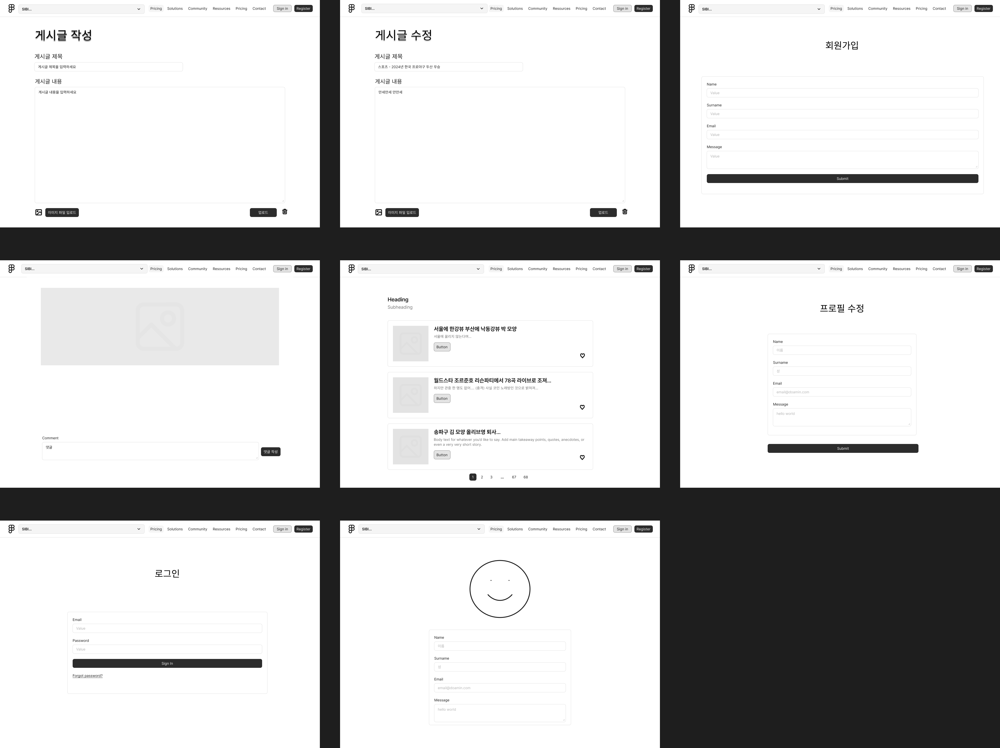
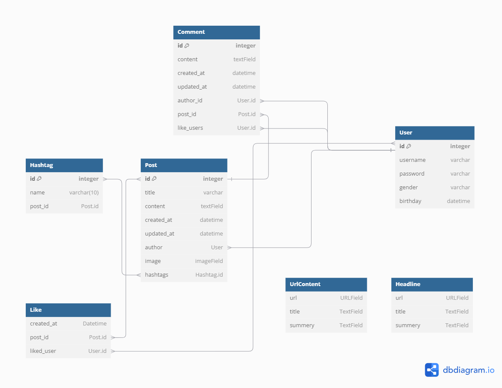

# SIBI

---


# Project Name
Sparta News

## 📖 Table of Contents
1. [About the Project](#About the Project)
2. [About Our Team](#About Our Team)
3. [Main Features](#Main Features)
4. [Development Period](#Development Period)
5. [Built With](#Built With)
6. [Wireframe](#Wireframe)
7. [API Specification](#API-Specification)
8. [ERD](#ERD)
9. [Porject Folder Structure](#Project Folder Structure)
10. [Trouble Shooting](#trouble-shooting)
    
## 👨‍🏫 About the Project
Sparta News is a news service that allows you to post links of the latest IT news and articles.

## About Our Team
    - Team Name:  시비조 (SIBI)
    - Members:  조준호, 김영빈, 김채림, 박연재
    - github: https://github.com/duswo3o/SIBI

## 💜 Main Features

- Feature 1: User features
  - Username, password, email, first_name, last_name, and brithday are required to sign up
  - Registered members can write, edit, and delete comments on posts
  - Registered members can write, modify, and delete comments on posts
  - Registered members can like posts and comments
  - Registered members can follow other registered members

- Feature 2: Post features
  - Create
    - A post must have a title and content, and can optionally include images and hashtags
    - Content is required to create a comment
  - Read
    - All users can read uploaded posts.
  - Edit and Delete
    - Only posts and comments authored by the user may be edited or deleted.

- Feature 3: Article features
  - Enter url of a Naver article to summarize the article
  - Provides a summary of the headline news of Naver articles
    - Displays web-crawled articles every day at 11 A.M.
    - 5 headline articles displayed


## ⏲️ Development Period
- 2024.09.11(Wed) ~ 2024.09.19(Thu)

## 📚️ Built With

### ✔️ Language

    ● python

### ✔️ Version Control

    ● Git
    ● GitHub

### ✔️ IDE

    ● Visual Studio Code
    ● PyCharm

### ✔️ Framework

    ● Django


### ✔️  DBMS

      ● SQLite3

### ✔️ COMMUNICATION

      ● slack
      ● zep
      ● notion


## Wireframe



## API Specification

- [SIBI_news API Specification](https://www.notion.so/teamsparta/8f9ba157cb8646d7a90c0d1827347c28?v=6d56ff1742c641789351681daa5daf0b&pvs=4)

## ERD



## Project Folder Strcture

```
📦 
├─ README.md
├─ SIBI_NEWS
│  ├─ __init__.py
│  ├─ asgi.py
│  ├─ settings.py
│  ├─ urls.py
│  └─ wsgi.py
├─ accounts
│  ├─ __init__.py
│  ├─ admin.
│  ├─ apps.py
│  ├─ migrations
│  │  ├─ 0001_initial.py
│  │  └─ __init__.py
│  ├─ models
│  ├─ serializers.py
│  ├─ tests.py
│  ├─ urls.py
│  ├─ validators.py
│  └─ views.py
├─ headline_crawling.py
├─ manage.py
├─ media
│  └─ images
│     ├─ pngwing.com_9.png
│     ├─ pngwing.com_9_JjSePaS.png
│     ├─ pngwing.com_9_YrpN9ne.png
│     └─ pngwing.com_9_kMyzdKD.png
├─ openai_test.py
├─ posts
│  ├─ __init__.py
│  ├─ adm
│  ├─ apps.py
│  ├─ crawling.py
│  ├─ migrations
│  │  ├─ 0001_initial.py
│  │  └─ __init__.py
│  ├─ models.
│  ├─ serializers.py
│  ├─ tests.py
│  ├─ urls.py
│  ├─ validators.py
│  └─ views.py
└─ requirements.txt
```
©generated by [Project Tree Generator](https://woochanleee.github.io/project-tree-generator)


## Trouble Shooting

- [SIBI_news Trouble Shooting](https://www.notion.so/teamsparta/4054f98bac9645ca90071a3a353c9a77?pvs=4)
